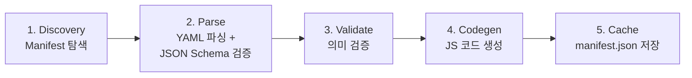
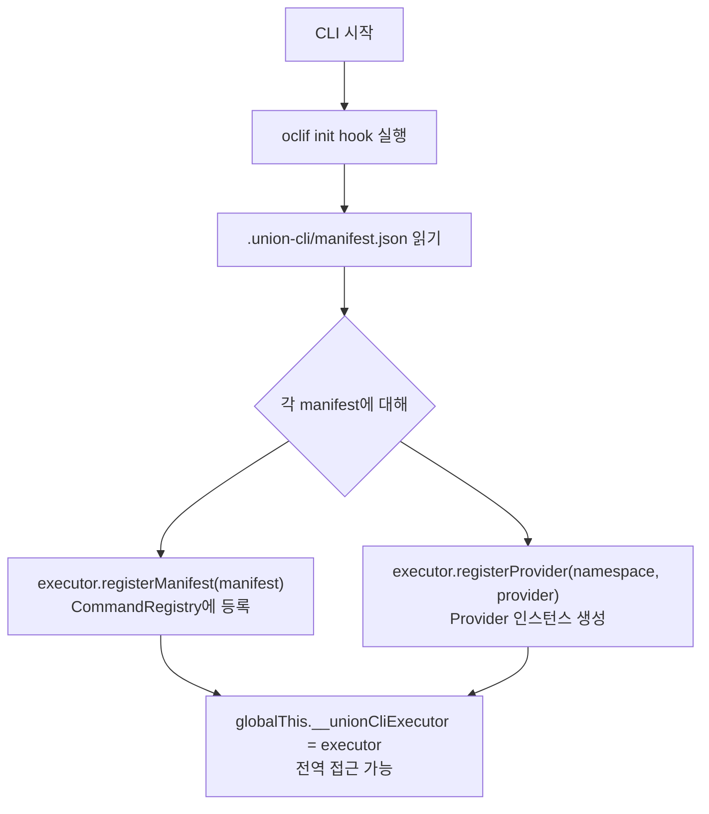

import ArchitectureFlow from '@site/src/components/ArchitectureFlow';
import ExecutionFlow from '@site/src/components/ExecutionFlow';

# Architecture

union-cli는 YAML 선언 한 장으로 팀 전용 통합 CLI를 만드는 프레임워크입니다. 이 문서에서는 **5-Layer 아키텍처**, **빌드 파이프라인**, **실행 흐름**, 그리고 각 **핵심 컴포넌트**를 설명합니다.

:::tip 먼저 읽으면 좋은 문서
[Manifest Reference](./manifest-reference)에서 YAML manifest 전체 스키마를 먼저 살펴보면 각 레이어의 역할이 더 잘 이해됩니다.
:::

---

## 5-Layer 아키텍처 개요

union-cli는 5개의 레이어로 구성됩니다. 사용자는 **Layer 1 (YAML manifest)만 작성**하면 나머지는 프레임워크가 처리합니다.

<ArchitectureFlow />

---

### Layer 1: Interface (YAML Manifest)

사용자가 작성하는 **유일한 파일**입니다. `plugins/` 디렉토리에 YAML manifest를 배치합니다.

| 항목 | 설명 |
|------|------|
| **역할** | CLI 커맨드, Provider 설정, 인증, 플래그를 선언적으로 정의 |
| **위치** | `plugins/*.yaml`, `.union-cli/plugins/*.yaml`, 또는 `$UNION_CLI_PLUGINS_DIR` |
| **원칙** | 코드 없이 YAML만으로 커맨드를 정의 |

```yaml
name: my-api
namespace: api
provider:
  type: http
  config:
    baseUrl: "https://api.example.com/v1"
commands:
  - id: users:list
    description: "사용자 목록"
    http: { method: GET, path: "/users" }
```

:::info
manifest 전체 스키마는 [Manifest Reference](./manifest-reference)를 참고하세요.
:::

---

### Layer 2: Build (빌드 파이프라인)

YAML manifest를 oclif 커맨드 JS 파일로 변환하는 **빌드 단계**입니다.

| 항목 | 설명 |
|------|------|
| **역할** | YAML 탐색 → 파싱 → 스키마 검증 → 의미 검증 → JS 코드 생성 |
| **입력** | `plugins/*.yaml` |
| **출력** | `dist/commands/<namespace>/<topic>/<action>.js` + `.union-cli/manifest.json` |

자세한 빌드 과정은 [빌드 파이프라인](#빌드-파이프라인) 섹션을 참고하세요.

---

### Layer 3: CLI (oclif)

[oclif](https://oclif.io/) 프레임워크가 제공하는 **CLI 런타임 레이어**입니다.

| 항목 | 설명 |
|------|------|
| **역할** | 커맨드 파싱, 표준 플래그(`--json`, `--format`, `--quiet`, `--debug`, `--no-color`), 도움말(`--help`), 자동완성 |
| **BaseCommand** | 모든 생성된 커맨드가 상속하는 기본 클래스. 표준 플래그를 정의하고 출력 형식을 결정 |

---

### Layer 4: Provider

실제 작업을 수행하는 **실행 엔진**입니다. 4가지 Provider 타입을 지원합니다.

| Provider | 실행 방식 | 사용 사례 |
|----------|-----------|-----------|
| **HTTP** | `fetch()` | REST API 호출 |
| **CLI** | `child_process.spawn()` | 외부 CLI 바이너리 래핑 (kubectl, terraform 등) |
| **Python** | JSON-RPC over stdio | Python SDK/라이브러리 호출 |
| **JS** | in-process ESM/CJS `import()` | Node.js 모듈 직접 호출 |

---

### Layer 5: Core Infrastructure

모든 레이어에서 공유하는 **핵심 인프라**입니다.

| 컴포넌트 | 역할 |
|----------|------|
| **Auth** | 인증 헤더 생성 (Bearer, Basic, JWT, API-Key, Cookie) |
| **Output** | 출력 형식 변환 (table, json, yaml, csv) |
| **Config** | 설정 관리 (`~/.my-cli/config.yaml`) |
| **CredentialStore** | 인증 정보 저장 (`.union-cli/tokens.json`) |
| **Error** | 통합 에러 처리, 에러 코드, 사용자 친화적 메시지 |

---

## 실행 흐름

사용자가 커맨드를 실행하면 다음 순서로 처리됩니다.

```bash
$ my-cli api users create --name "John" --email "john@example.com" --json
```

<ExecutionFlow />

### 실행 단계 요약

| 단계 | 설명 |
|------|------|
| **1. oclif 초기화** | init hook 실행 → `manifest.json` 로드 → Executor/Provider 등록 |
| **2. 커맨드 파싱** | `dist/commands/api/users/create.js` 로드 → args, flags 파싱 |
| **3. Executor 호출** | CommandRegistry에서 CommandSpec 조회 → namespace로 Provider 선택 |
| **4. Provider 실행** | URL 구성, 파라미터 매핑, 인증 헤더 주입, `fetch()` 실행 |
| **5. 출력** | `--json` 플래그 감지 → `JSON.stringify(result.data)` → stdout 출력 |

---

## 빌드 파이프라인

`npm run build` 실행 시 다음 단계가 순서대로 진행됩니다.



### 1. Manifest 탐색 (Discovery)

4개 위치에서 YAML manifest 파일을 탐색합니다 (우선순위 순서).

| 순서 | 경로 | 설명 |
|------|------|------|
| 1 | `.union-cli/plugins/*.yaml` | 프로젝트 로컬 |
| 2 | `plugins/*.yaml` | 프로젝트 루트 |
| 3 | `~/.<cliName>/plugins/*.yaml` | 사용자 글로벌 |
| 4 | `$UNION_CLI_PLUGINS_DIR/*.yaml` | 환경변수 지정 |

### 2. YAML 파싱 (Parse)

각 YAML 파일을 파싱하고 JSON Schema(AJV)로 구조를 검증합니다.

- **필수 필드**: `name`, `namespace`, `description`, `provider`, `commands`
- **namespace 규칙**: `^[a-z][a-z0-9-]*$`
- **command ID 규칙**: `^[a-z][a-z0-9-]*:[a-z][a-z0-9-]*$` (`topic:action` 형태)

### 3. 의미 검증 (Validate)

| 검증 항목 | 설명 |
|-----------|------|
| **중복 command ID** | 같은 manifest 내에서 동일한 ID가 있으면 에러 |
| **Provider-Command 매칭** | HTTP provider인데 `http` 설정이 없으면 에러 |
| **표준 플래그 충돌** | `--json`, `--debug`, `--quiet`, `--no-color`, `--format`, `--help`과 이름이 같으면 에러 |
| **단축키 충돌** | `-h`, `-q` 단축키 사용 시 에러 |

:::warning 민감 플래그 경고
`password`, `secret`, `token` 등의 이름을 가진 플래그는 경고가 출력됩니다. ps/history에 노출될 위험이 있으므로 [SecretRef](./manifest-reference#환경변수-치환)를 사용하세요.
:::

### 4. 코드 생성 (Codegen)

각 manifest 커맨드에 대해 oclif Command JS 파일을 생성합니다.

```
plugins/my-api.yaml
  commands:
    - id: users:list      → dist/commands/api/users/list.js
    - id: users:create    → dist/commands/api/users/create.js
```

추가로 Built-in 커맨드도 함께 생성됩니다: `auth/login.js`, `auth/status.js`, `auth/logout.js`, `doctor.js`

### 5. 캐시 저장

파싱된 manifest를 `.union-cli/manifest.json`에 캐시합니다. 이 파일은 CLI 실행 시 init hook에서 Executor와 Provider를 초기화하는 데 사용됩니다.

---

## Init Hook 흐름

CLI가 실행될 때 oclif의 init hook이 **가장 먼저 동작**합니다.



:::info codegen 커맨드와의 연결
codegen으로 생성된 커맨드 파일은 `globalThis.__unionCliExecutor`를 통해 Executor에 접근하여 커맨드를 실행합니다.
:::

---

## 핵심 컴포넌트

### CommandRegistry

커맨드 정의(CommandSpec)를 관리하는 **중앙 레지스트리**입니다.

| 항목 | 설명 |
|------|------|
| **Interface** | `CommandSpec` -- id, namespace, description, args, flags, examples, providerType, providerConfig |
| **Key Methods** | `register(manifest)`, `get(id)`, `getByNamespace(ns)`, `getAllSpecs()`, `getAllManifests()` |
| **Purpose** | 중복 namespace 검사와 함께 PluginManifest를 등록하고, 전체 ID로 CommandSpec을 조회 |

---

### Executor

Provider를 선택하고 커맨드 실행을 조율하는 **오케스트레이터**입니다.

| 항목 | 설명 |
|------|------|
| **Interface** | `registerProvider(ns, provider)`, `registerManifest(manifest)`, `execute(specId, input): Promise<ExecutionResult>` |
| **ExecutionResult** | `success`, `data`, `exitCode` (0/1/2), `duration` (ms), `error?` (code + message + details) |
| **Purpose** | CommandRegistry에서 spec 조회 후 namespace에 매칭되는 Provider를 선택하여 실행 |

---

### BaseCommand

모든 생성된 커맨드가 상속하는 oclif Command **기본 클래스**입니다.

| 플래그 | 단축키 | 설명 |
|--------|--------|------|
| `--json` | | JSON 출력 |
| `--debug` | | 디버그 출력 (에러 상세 포함) |
| `--quiet` | `-q` | 최소 출력 (exit code만 반환) |
| `--no-color` | | 색상/이모지 비활성화 |
| `--format` | | 출력 형식 (`table`, `json`, `yaml`, `csv`) |

---

### CredentialStore

인증 정보를 파일 시스템에 저장하고 관리합니다.

| 항목 | 설명 |
|------|------|
| **FileCredentialStore** | 파일 기반 (`~/.my-cli/credentials/<namespace>.json`), 파일 권한 `0600` |
| **EnvCredentialStore** | 환경변수 기반 (`<NAMESPACE>_TOKEN`), 읽기 전용 |
| **SecretRef 소스** | `env` (환경변수), `file` (파일), `command` (커맨드 실행), `value` (직접 값, 테스트용) |

:::danger 보안 주의
`value`는 YAML에 직접 비밀값을 노출하므로 **테스트 환경에서만 사용**하세요. 프로덕션에서는 `env` 또는 `command`를 권장합니다.
:::

---

## 디렉토리 구조

```
src/
├── core/                 # Layer 5: Core Infrastructure
│   ├── types.ts          # 모든 TypeScript 인터페이스 정의
│   ├── registry.ts       # CommandRegistry
│   ├── executor.ts       # Executor
│   ├── base-command.ts   # BaseCommand
│   ├── auth.ts           # AuthManager
│   ├── credential-store.ts
│   ├── config.ts         # ConfigManager
│   ├── output.ts         # OutputFormatter
│   └── error.ts          # UnifiedError
│
├── manifest/             # Layer 2: Build (파싱/검증)
│   ├── schema.ts         # AJV JSON Schema
│   ├── parser.ts         # YAML 파싱 + 스키마 검증
│   └── validator.ts      # 의미 검증
│
├── providers/            # Layer 4: Provider
│   ├── http/             # HTTPProvider (fetch)
│   ├── cli/              # CLIProvider (spawn)
│   ├── python/           # PythonProvider (JSON-RPC)
│   └── js/               # JSProvider (in-process)
│
├── build/                # Layer 2: Build (코드 생성)
│   ├── discovery.ts      # Manifest 파일 탐색
│   ├── builder.ts        # 빌드 오케스트레이션
│   └── codegen.ts        # oclif Command JS 코드 생성
│
├── commands/             # Built-in 커맨드
│   ├── auth/             # login, logout, status, token
│   ├── config/           # get, set, list, reset
│   ├── plugin/           # add, remove, list
│   └── ...               # build, codegen, doctor, init
│
├── hooks/
│   └── init.ts           # oclif init hook
│
└── index.ts              # 공개 API export
```

---

## 환경변수 치환

manifest의 `baseUrl` 등에서 환경변수를 참조할 수 있습니다.

```yaml
baseUrl: "${BASE_URL:-https://default.example.com}/api/v1"
```

| 문법 | 설명 |
|------|------|
| `${VAR_NAME}` | 환경변수 값으로 치환. 없으면 빈 문자열 |
| `${VAR_NAME:-기본값}` | 환경변수가 없으면 기본값 사용 |

:::tip
환경변수 치환에 대한 자세한 내용은 [Manifest Reference - 환경변수 치환](./manifest-reference#환경변수-치환)을 참고하세요.
:::
