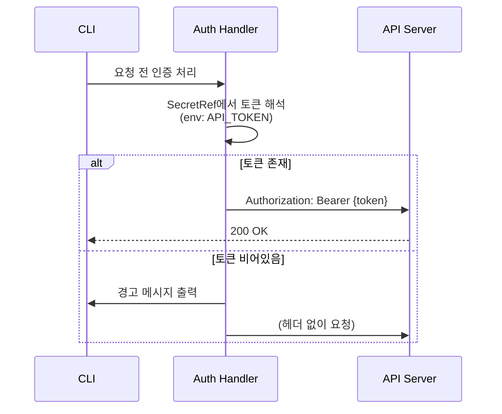
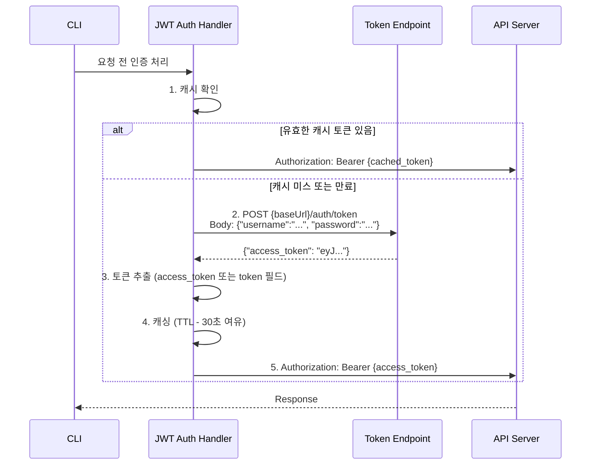

import Tabs from '@theme/Tabs';
import TabItem from '@theme/TabItem';

# Auth

union-cli는 다양한 인증 방식을 지원합니다. 이 문서에서는 각 인증 타입의 설정 방법과 동작 원리를 설명합니다.

## 인증 타입 비교

어떤 인증 방식을 사용해야 할지 빠르게 결정할 수 있는 비교표입니다.

| 타입 | 동작 | 사용 사례 | 자동 갱신 | 브라우저 필요 |
|---|---|---|---|---|
| `none` | 인증 없이 요청 | 공개 API | - | - |
| `bearer` | `Authorization: Bearer {token}` | 대부분의 API | N | N |
| `basic` | `Authorization: Basic {base64}` | 기본 인증 | N | N |
| `jwt` | 자동 토큰 발급 + TTL 캐싱 | 토큰 자동 갱신이 필요한 API | **Y** | N |
| `api-key` | `{headerName}: {token}` | API Key 인증 | N | N |
| `cookie` | OAuth 브라우저 로그인 -> 쿠키 저장 | SSO/OAuth 기반 서비스 | N | **Y** |

:::tip 어떤 인증을 선택할까?
- **API 토큰을 환경변수로 관리** → `bearer` 또는 `api-key`
- **username/password 기반** → `basic` (단순) 또는 `jwt` (자동 갱신 필요 시)
- **SSO/OAuth 기반 서비스** → `cookie`
- **공개 API** → `none` (생략 가능)
:::

---

## SecretRef - 비밀값 참조

토큰, 비밀번호 등 민감한 값은 YAML에 직접 넣지 않고 **SecretRef**로 참조합니다. 4가지 소스를 지원합니다.

<Tabs>
<TabItem value="env" label="env (환경변수)" default>

```yaml
token:
  env: "MY_API_TOKEN"
```

`process.env.MY_API_TOKEN`에서 읽습니다. **가장 일반적인 방식**입니다.

```bash
export MY_API_TOKEN="your-secret-token"
my-cli api users list
```

**적합한 환경**: CI/CD, 로컬 개발, Docker 컨테이너

</TabItem>
<TabItem value="file" label="file (파일)">

```yaml
token:
  file: "/path/to/token.txt"
```

파일 내용을 읽어 토큰으로 사용합니다.

**적합한 환경**: Kubernetes Secret mount, Docker Secret, 파일 기반 인증

</TabItem>
<TabItem value="command" label="command (커맨드 실행)">

```yaml
token:
  command: "vault read -field=token secret/api"
```

셸 커맨드를 실행하고 stdout 결과를 토큰으로 사용합니다.

**적합한 환경**: HashiCorp Vault, AWS Secrets Manager, 1Password CLI 등 외부 Secret 관리 도구

</TabItem>
<TabItem value="value" label="value (직접 값)">

```yaml
token:
  value: "literal-token"
```

:::danger 프로덕션 사용 금지
`value`는 **테스트/개발 용도로만** 사용하세요. YAML 파일에 비밀값이 직접 노출되므로 프로덕션에서는 절대 사용하지 마세요.
:::

</TabItem>
</Tabs>

### SecretRef 해석 우선순위

여러 소스가 지정된 경우 다음 순서로 첫 번째 유효한 값을 사용합니다:

1. `env` (환경변수)
2. `file` (파일)
3. `command` (커맨드 실행)
4. `value` (직접 값)

모든 소스에서 값을 찾지 못하면 `null`을 반환합니다.

---

## none - 인증 없음

공개 API처럼 인증이 필요 없는 경우에 사용합니다.

```yaml
provider:
  type: http
  config:
    baseUrl: "https://public-api.example.com/v1"
    auth:
      type: none
```

:::info auth 생략 가능
`auth` 설정 자체를 생략해도 동일하게 동작합니다. `type: none`은 명시적으로 "인증 없음"을 표현할 때 사용합니다.
:::

---

## bearer - Bearer Token

API 토큰을 이미 발급받아 가지고 있는 경우 사용합니다. 가장 일반적인 API 인증 방식입니다.

### YAML 설정

```yaml
auth:
  type: bearer
  token:
    env: "API_TOKEN"
```

### 사용 방법

```bash
export API_TOKEN="eyJhbGciOiJIUzI1NiIsInR5cCI6IkpXVCJ9..."
my-cli api users list --json
```

### 동작 흐름



---

## basic - Basic 인증

username과 password 기반의 간단한 인증이 필요할 때 사용합니다.

### YAML 설정

```yaml
auth:
  type: basic
  credentials:
    username:
      env: "API_USER"
    password:
      env: "API_PASS"
```

### 사용 방법

```bash
export API_USER="admin"
export API_PASS="secret123"
my-cli api users list --json
```

---

## jwt - JWT 자동 토큰 발급

username/password로 토큰을 발급받아야 하고, 토큰 자동 갱신(TTL 캐싱)이 필요한 경우에 사용합니다.

### YAML 설정

```yaml
auth:
  type: jwt
  tokenEndpoint: "/auth/token"     # baseUrl + tokenEndpoint에 POST
  tokenTTL: 1800                   # 캐싱 TTL (초, 기본 1800 = 30분)
  credentials:
    username:
      env: "JWT_USER"
    password:
      env: "JWT_PASS"
```

### 사용 방법

```bash
export JWT_USER="admin"
export JWT_PASS="password"
my-cli api users list --json
# 첫 요청: 토큰 자동 발급 -> API 호출
# 두 번째 요청: 캐시된 토큰으로 바로 API 호출
```

### 동작 방식



### 토큰 응답 형식

토큰 endpoint는 다음 중 하나의 형식으로 응답해야 합니다:

<Tabs>
<TabItem value="access_token" label="access_token (우선)" default>

```json
{"access_token": "eyJ..."}
```

</TabItem>
<TabItem value="token" label="token">

```json
{"token": "eyJ..."}
```

</TabItem>
</Tabs>

:::info 필드 우선순위
`access_token` 필드가 `token` 필드보다 우선됩니다. 둘 다 있으면 `access_token`을 사용합니다.
:::

---

## api-key - API Key

API Key를 커스텀 헤더로 전송해야 하는 경우에 사용합니다. `Authorization` 헤더가 아닌 별도 헤더(예: `X-API-Key`)를 사용하는 서비스에 적합합니다.

### YAML 설정

```yaml
auth:
  type: api-key
  token:
    env: "API_KEY"
  headerName: "X-API-Key"     # 헤더 이름 (기본값: X-API-Key)
```

### 사용 방법

```bash
export API_KEY="ak-1234567890"
my-cli api users list --json
# -> 요청 헤더: X-API-Key: ak-1234567890
```

---

## cookie - OAuth 브라우저 로그인

SSO/OAuth 기반 서비스에서 브라우저 로그인 후 쿠키를 추출하여 API를 호출해야 하는 경우에 사용합니다.

### YAML 설정

```yaml
auth:
  type: cookie
  serviceName: "my-service"   # tokens.json에서 사용할 키
  tokenFile: null             # 선택. 토큰 파일 경로 (기본: .union-cli/tokens.json)
```

### 사용 방법

```bash
my-cli auth login              # 브라우저에서 OAuth 로그인
my-cli api users list --json   # 저장된 쿠키 자동 사용
```

### 동작 방식 - 로그인 흐름

```mermaid
sequenceDiagram
    participant User as 사용자
    participant CLI as CLI (auth login)
    participant API as API Server
    participant Browser as 브라우저
    participant Chrome as Chrome Cookie DB

    User->>CLI: my-cli auth login
    CLI->>API: GET {baseUrl}/api/v1/auth/login
    API-->>CLI: {auth_url: "https://sso.example.com/..."}
    CLI->>Browser: auth_url 열기
    Browser->>User: OAuth 로그인 페이지
    User->>Browser: 로그인 완료
    User->>CLI: Enter 키 입력
    CLI->>Chrome: 쿠키 DB에서 해당 호스트 쿠키 복호화
    Note right of Chrome: macOS Chrome Safe Storage<br/>AES 복호화
    Chrome-->>CLI: session=...; token=...
    CLI->>CLI: .union-cli/tokens.json에 저장
    CLI-->>User: 쿠키 저장 완료
```

### 동작 방식 - 요청 흐름

1. `.union-cli/tokens.json`에서 `serviceName`에 해당하는 쿠키를 읽습니다.
2. 요청 헤더에 `Cookie: {cookies}`를 추가합니다.
3. 쿠키에서 `*_token` 패턴의 값을 추출하여 `Authorization: Bearer {token}` 헤더도 추가합니다 (API 호환성).
4. 쿠키가 없으면 `"auth login" 먼저 실행하세요` 경고를 출력합니다.

---

## CredentialStore

인증 정보를 파일 시스템에 저장하고 관리하는 컴포넌트입니다.

### tokens.json

Cookie 인증에서 사용하는 토큰 파일입니다.

**위치**: `.union-cli/tokens.json` (프로젝트 루트 기준)

```json
{
  "my-service": {
    "cookies": "session_token=eyJ...; refresh_token=eyJ...",
    "savedAt": "2026-04-07T09:00:00.000Z"
  }
}
```

### FileCredentialStore

파일 기반 인증 정보 저장소입니다.

- **위치**: `~/.my-cli/credentials/<namespace>.json`
- **파일 권한**: `0600` (소유자만 읽기/쓰기)

### EnvCredentialStore

환경변수 기반 인증 정보 저장소입니다. **읽기 전용**입니다.

```bash
# namespace가 "api"인 경우
export API_TOKEN="your-token"
# EnvCredentialStore.get("api") -> {"token": "your-token"}
```

---

## CLI 커맨드

인증 관련 CLI 커맨드(login, logout, status, token)는 [CLI 커맨드 가이드](./commands#auth---인증-관리)를 참조하세요.

---

## 보안 Best Practices

:::danger 절대 금지
- YAML 파일에 토큰이나 비밀번호를 **직접 입력하지 마세요**. 반드시 SecretRef (`env`, `file`, `command`)를 사용하세요.
- 프로덕션에서 `value` SecretRef를 **사용하지 마세요**. `value`는 테스트 용도로만 사용합니다.
:::

:::warning 주의사항
- **민감 플래그 이름을 피하세요**: `--password`, `--secret`, `--token` 등의 이름은 `ps` 명령어와 셸 히스토리에 노출됩니다. 빌드 시 경고가 출력됩니다.
- **파일 권한을 확인하세요**: FileCredentialStore는 자동으로 `0600` 권한을 설정하지만, tokens.json은 수동으로 권한을 확인하는 것이 좋습니다.
:::

:::tip 권장사항
**tokens.json을 버전 관리에서 제외하세요**:

```gitignore
# .gitignore
.union-cli/tokens.json
.union-cli/credentials/
```

**외부 Secret Manager 연동** 시 `command` SecretRef를 활용하세요:

```yaml
token:
  command: "vault read -field=token secret/api"
  # 또는
  command: "aws secretsmanager get-secret-value --secret-id my-api --query SecretString --output text"
  # 또는
  command: "op read op://vault/api-token/credential"
```
:::
