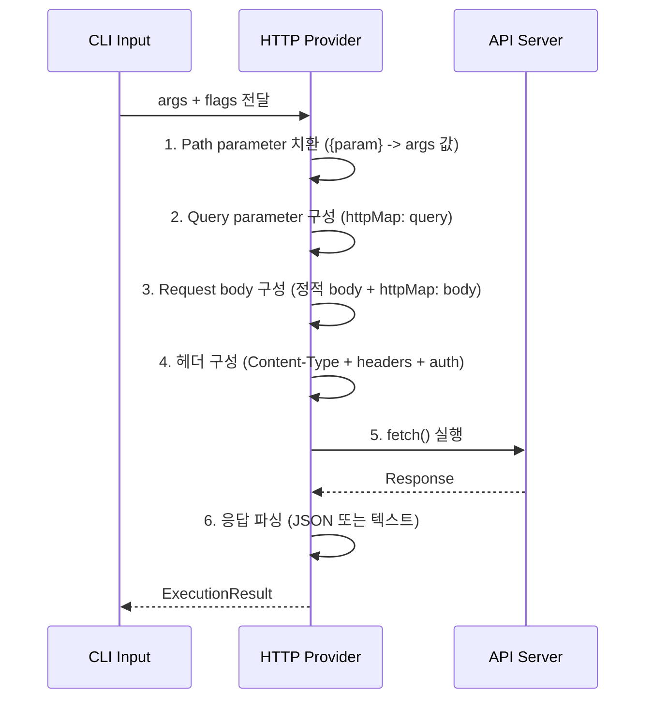
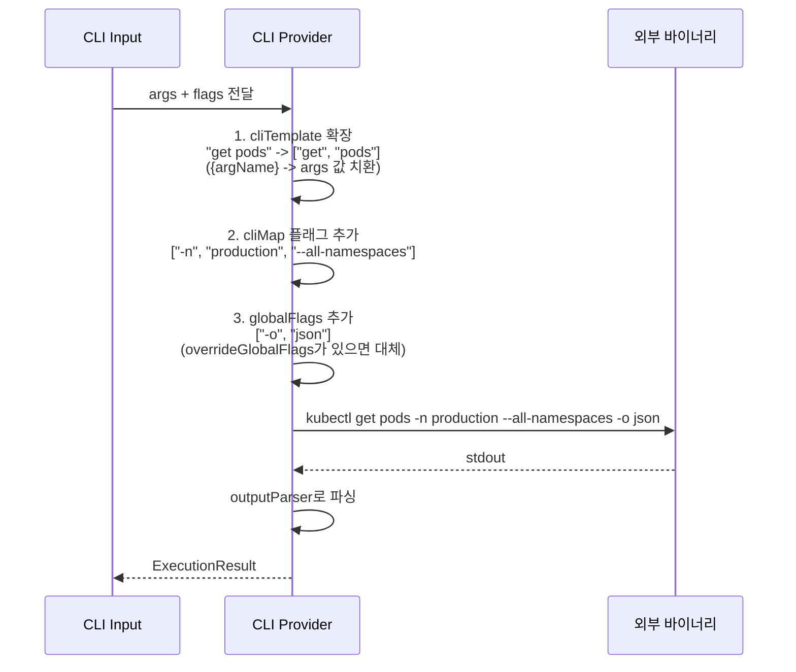
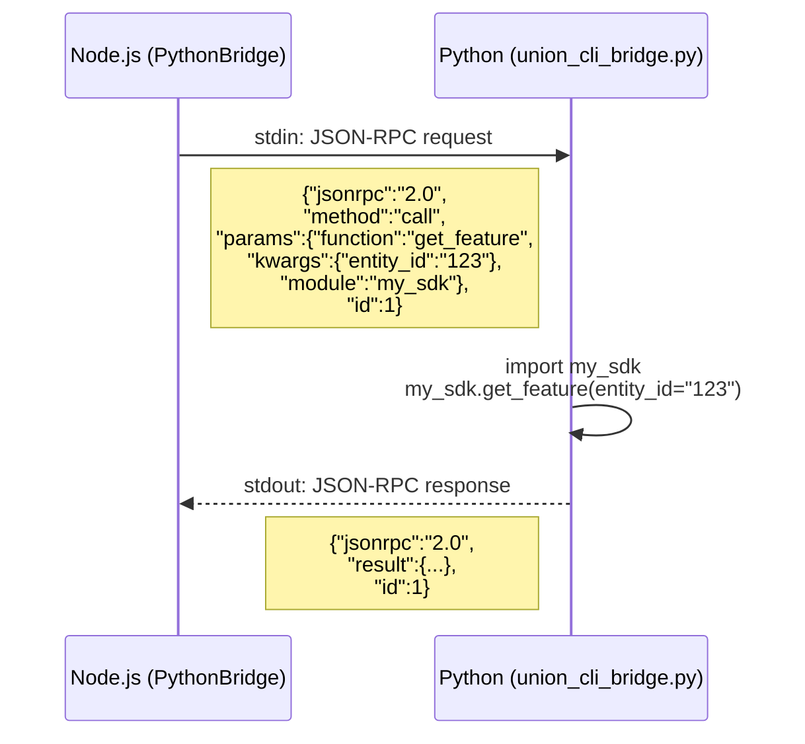

import Tabs from '@theme/Tabs';
import TabItem from '@theme/TabItem';

# Providers

Provider는 union-cli에서 실제 작업을 수행하는 실행 엔진입니다. 4가지 Provider 타입을 지원하며, 각각 다른 백엔드 시스템과 통신합니다.

## Quick Comparison

어떤 Provider를 선택해야 할지 빠르게 비교할 수 있는 표입니다.

| | **HTTP** | **CLI** | **Python** | **JS** |
|---|---|---|---|---|
| **용도** | REST API 호출 | 외부 CLI 바이너리 래핑 | Python 함수 호출 | Node.js 모듈 호출 |
| **통신 방식** | `fetch()` | `child_process.spawn()` | JSON-RPC over stdio | in-process 직접 호출 |
| **응답 속도** | ~50ms+ (네트워크 RTT) | ~100ms+ (프로세스 spawn) | ~10ms (persistent) / ~500ms+ (one-shot) | **~1ms** (가장 빠름) |
| **인증 지원** | bearer, basic, jwt, api-key, cookie | N/A | N/A | N/A |
| **대표 사례** | 내부/외부 REST API | kubectl, terraform, docker | ML SDK, 데이터 파이프라인 | 유틸리티 모듈 |

:::tip Provider 선택 기준
- **REST API가 있다면** → HTTP Provider
- **이미 잘 동작하는 CLI 도구가 있다면** → CLI Provider
- **Python 라이브러리/SDK를 사용해야 한다면** → Python Provider
- **최대 성능이 필요하거나 Node.js 모듈이라면** → JS Provider
:::

---

## Provider 개념

모든 Provider는 `IProvider` 인터페이스를 구현합니다:

```typescript
interface IProvider {
  readonly type: ProviderType;   // 'http' | 'cli' | 'python' | 'js'
  resolveCommands(manifest: PluginManifest): CommandSpec[];
  execute(spec: CommandSpec, input: ExecutionInput): Promise<ExecutionResult>;
  healthCheck?(): Promise<HealthCheckResult>;
}
```

- **`execute()`**: 커맨드의 args와 flags를 받아 Provider별 방식으로 실행하고 `ExecutionResult`를 반환합니다.
- **`healthCheck()`**: Provider의 연결 상태를 확인합니다 (`doctor` 커맨드에서 사용).

### Health Check 방식

| Provider | Health Check 방식 |
|----------|-----------------|
| HTTP | baseUrl에 GET 요청 (5초 타임아웃) |
| CLI | `{binary} version` 또는 `--version` |
| Python | `python3 --version` |
| JS | 모듈 `import()` 시도 |

---

## Provider 설정

4가지 Provider의 YAML 설정 요약입니다. 전체 설정 필드는 [Manifest 레퍼런스](./manifest-reference#provider-설정)를 참조하세요.

```yaml
# HTTP
provider:
  type: http
  config:
    baseUrl: "${BASE_URL:-https://api.example.com}/v1"
    auth: { ... }               # 인증 설정 (auth 문서 참조)
    headers: { ... }            # 기본 HTTP 헤더
    timeout: 30000              # ms (기본 30000)

# CLI
provider:
  type: cli
  config:
    binary: kubectl
    globalFlags: ["-o", "json"]

# Python
provider:
  type: python
  config:
    module: "my_sdk"
    persistent: true
    venv: "${MY_VENV_PATH}"

# JS
provider:
  type: js
  config:
    module: "./lib/sdk.js"
```

---

## Provider 별 상세 가이드

<Tabs>
<TabItem value="http" label="HTTP" default>

### HTTP Provider

REST API를 `fetch()`로 호출합니다. 가장 일반적으로 사용되는 Provider입니다.

- 환경변수 치환 (`${VAR:-default}`) 지원
- [인증](./auth) 내장 (bearer, basic, jwt, api-key, cookie)
- Flag → query / body / header 자동 매핑

#### 커맨드 설정

```yaml
commands:
  - id: users:create
    description: "사용자 생성"
    http:
      method: POST               # GET, POST, PUT, PATCH, DELETE
      path: "/users"             # baseUrl에 이어붙는 경로
      body:                      # 정적 body (flag와 병합됨)
        source: "cli"
```

#### 주요 기능

**Flag 매핑 (httpMap)**

플래그 값을 HTTP 요청의 어떤 부분으로 매핑할지 지정합니다.

**Query parameter:**

```yaml
flags:
  - name: status
    httpMap: query
    # -> GET /users?status=active
```

**Request body:**

```yaml
flags:
  - name: name
    httpMap: body
    # -> POST /users  body: {"name": "John"}
```

**Header:**

```yaml
flags:
  - name: trace-id
    httpMap: header
    # -> 요청 헤더에 추가: trace-id: <value>
```

`httpName`으로 CLI 플래그 이름과 API 파라미터 이름을 다르게 매핑할 수 있습니다 (`--per-page` → `?per_page=20`).

전체 매핑 옵션과 `httpBodyType`에 대한 자세한 설명은 [Manifest 레퍼런스](./manifest-reference#provider별-매핑-속성)를 참조하세요.

**httpBodyType (Body 값 변환)**

body로 매핑된 flag 값의 타입을 변환합니다:

| httpBodyType | 변환 | 입력 예시 | 결과 |
|---|---|---|---|
| `json` | `JSON.parse()` | `'{"k":"v"}'` | `{"k":"v"}` |
| `array` | 콤마 split | `"a,b,c"` | `["a","b","c"]` |
| `number-array` | 콤마 split + Number | `"1,2,3"` | `[1,2,3]` |

**Path Parameter**

URL 경로에 동적 값을 삽입합니다. `args`로 정의한 값이 `{param}` 위치에 대체됩니다:

```yaml
commands:
  - id: users:get
    description: "사용자 상세 조회"
    http:
      method: GET
      path: "/users/{user_id}/posts/{post_id}"
    args:
      - name: user_id
        required: true
      - name: post_id
        required: true
```

```bash
my-cli api users get user-123 post-456
# -> GET https://api.example.com/v1/users/user-123/posts/post-456
```

:::info Path parameter 인코딩
Path parameter 값은 자동으로 `encodeURIComponent()`로 인코딩됩니다. 특수 문자가 포함된 값도 안전하게 전달됩니다.
:::

#### 실행 순서

HTTP Provider는 다음 순서로 요청을 구성합니다:



#### 실전 예제

```yaml
name: user-service
namespace: api
provider:
  type: http
  config:
    baseUrl: "${API_URL:-https://api.example.com}/v1"
    auth:
      type: bearer
      token:
        env: "API_TOKEN"

commands:
  - id: users:list
    description: "사용자 목록 조회"
    http: { method: GET, path: "/users" }
    flags:
      - name: limit
        type: number
        default: 20
        httpMap: query
      - name: status
        httpMap: query

  - id: users:create
    description: "사용자 생성"
    http: { method: POST, path: "/users" }
    flags:
      - name: name
        required: true
        httpMap: body
      - name: email
        required: true
        httpMap: body
      - name: tags
        httpMap: body
        httpBodyType: array
```

</TabItem>
<TabItem value="cli" label="CLI">

### CLI Provider

외부 CLI 바이너리(kubectl, terraform, docker 등)를 래핑합니다. `child_process.spawn()`으로 실행합니다.

- `child_process.spawn()`으로 안전하게 실행
- 다양한 출력 파서(json, yaml, table, csv 등) 내장
- globalFlags로 공통 옵션 자동 적용

#### 커맨드 설정

```yaml
commands:
  - id: pods:list
    description: "Pod 목록 조회"
    cli:
      template: "get pods"       # binary 뒤에 붙는 서브커맨드
    outputParser: json            # 출력 파싱 방식
    overrideGlobalFlags: []       # globalFlags 비활성화 (빈 배열)
```

#### 주요 기능

**cliTemplate**

`template`은 바이너리 뒤에 붙는 기본 인자입니다. `{argName}` placeholder를 사용할 수 있습니다:

```yaml
commands:
  - id: pods:describe
    cli:
      template: "describe pod {name}"
    args:
      - name: name
        required: true
# -> kubectl describe pod my-pod -o json
```

**cliMap (Flag 매핑)**

플래그 값을 CLI 인자로 변환합니다:

```yaml
flags:
  # 값이 있는 플래그: {value} placeholder 사용
  - name: namespace
    char: "n"
    cliMap: "-n {value}"
    # --namespace production -> -n production

  # Boolean 플래그: 그대로 추가
  - name: all-namespaces
    type: boolean
    cliMap: "--all-namespaces"
    # --all-namespaces -> --all-namespaces (값이 true일 때만)
```

**outputParser (출력 파싱)**

CLI 바이너리의 stdout을 파싱하는 방식을 지정합니다:

| outputParser | 동작 | 사용 사례 |
|---|---|---|
| `json` | `JSON.parse(stdout)` | kubectl -o json |
| `yaml` | YAML 파싱 | kubectl -o yaml |
| `line` | stdout을 그대로 단일 문자열로 반환 | 단일 값 출력 |
| `lines` | 줄바꿈으로 분리하여 문자열 배열로 반환 | 목록 출력 |
| `table` | 공백 구분 테이블 파싱 | `ps`, `df` 출력 |
| `csv` | 콤마 구분 테이블 파싱 | CSV 출력 |
| `regex` | 원본 문자열 그대로 반환 | 커스텀 후처리 |

**overrideGlobalFlags**

특정 커맨드에서 globalFlags를 무시하거나 변경할 때 사용합니다:

```yaml
commands:
  - id: pods:list-yaml
    cli:
      template: "get pods"
    overrideGlobalFlags: ["-o", "yaml"]   # globalFlags 대신 이 값 사용

  - id: pods:version
    cli:
      template: "version"
    overrideGlobalFlags: []               # globalFlags 비활성화 (빈 배열)
```

:::info overrideGlobalFlags 동작
`overrideGlobalFlags`가 설정되면 provider의 `globalFlags`를 **완전히 대체**합니다. 빈 배열(`[]`)이면 globalFlags가 적용되지 않습니다.
:::

#### CLI 인자 조립 순서



#### 실전 예제

```yaml
name: k8s-tools
namespace: k8s
provider:
  type: cli
  config:
    binary: kubectl
    globalFlags: ["-o", "json"]

commands:
  - id: pods:list
    description: "Pod 목록 조회"
    cli: { template: "get pods" }
    flags:
      - name: namespace
        char: "n"
        cliMap: "-n {value}"
      - name: all-namespaces
        type: boolean
        cliMap: "--all-namespaces"
    outputParser: json

  - id: pods:describe
    description: "Pod 상세 정보"
    cli: { template: "describe pod {name}" }
    args:
      - name: name
        required: true
    overrideGlobalFlags: []
```

</TabItem>
<TabItem value="python" label="Python">

### Python Provider

Python 함수를 JSON-RPC over stdio 프로토콜로 호출합니다.

- persistent 모드로 프로세스 재사용 (빠른 반복 호출)
- virtualenv 지원
- kebab-case → snake_case 자동 이름 변환

#### 커맨드 설정

```yaml
commands:
  - id: features:get
    description: "피처 조회"
    python:
      function: "get_feature"    # 호출할 Python 함수 이름
    flags:
      - name: entity-id
        required: true
        pythonName: "entity_id"  # CLI kebab-case -> Python snake_case
```

#### 주요 기능

**pythonName (이름 변환)**

CLI의 kebab-case 플래그 이름을 Python의 snake_case로 변환합니다:

```yaml
flags:
  - name: entity-id
    pythonName: "entity_id"
    # --entity-id "e-123" -> kwargs = {"entity_id": "e-123"}
```

:::tip 자동 이름 변환
`pythonName`을 지정하지 않으면 자동으로 하이픈(`-`)을 언더스코어(`_`)로 변환합니다. 대부분의 경우 명시적 지정이 필요 없습니다.
:::

**JSON-RPC Bridge**

Python Provider는 JSON-RPC over stdio 프로토콜로 Python 프로세스와 통신합니다:



**persistent 모드**

<Tabs>
<TabItem value="oneshot" label="One-shot (기본)" default>

```yaml
persistent: false    # 기본값
```

매 호출마다 Python 프로세스를 생성하고 종료합니다. 호출 빈도가 낮을 때 적합합니다.

- 장점: 메모리 사용량이 적음
- 단점: 호출당 ~500ms+ 오버헤드 (프로세스 spawn + Python 초기화)

</TabItem>
<TabItem value="persistent" label="Persistent">

```yaml
persistent: true
idleTimeout: 300     # 5분 유휴 후 자동 종료
```

첫 호출 시 프로세스를 생성하고, 이후 호출에서 재사용합니다. `idleTimeout` 동안 호출이 없으면 자동 종료됩니다.

- 장점: 호출당 ~10ms (프로세스 재사용)
- 단점: 유휴 시에도 메모리 점유

</TabItem>
</Tabs>

**virtualenv 지원**

```yaml
venv: "/path/to/myenv"
```

설정 시:
- Python 경로: `/path/to/myenv/bin/python3`
- `VIRTUAL_ENV` 환경변수 설정
- `PATH`에 venv/bin을 우선 추가

:::warning venv 경로 확인
환경변수로 venv 경로를 지정하는 경우 (`venv: "${MY_VENV_PATH}"`), 해당 환경변수가 설정되어 있는지 확인하세요. 미설정 시 시스템 기본 Python이 사용됩니다.
:::

#### 실전 예제

```yaml
name: ml-features
namespace: ml
provider:
  type: python
  config:
    module: "feast"
    persistent: true
    venv: "${FEAST_VENV}"

commands:
  - id: features:get
    description: "피처 벡터 조회"
    python: { function: "get_online_features" }
    flags:
      - name: entity-id
        required: true
        pythonName: "entity_id"
      - name: feature-list
        required: true
        pythonName: "feature_list"
```

</TabItem>
<TabItem value="js" label="JS">

### JS Provider

Node.js ESM/CJS 모듈을 in-process로 직접 호출합니다. 가장 빠릅니다.

- ESM/CJS 자동 감지, 모듈 캐싱
- args + flags를 하나의 객체로 병합하여 함수에 전달

#### 커맨드 설정

```yaml
commands:
  - id: data:export
    description: "데이터 내보내기"
    js:
      function: "exportData"     # 모듈에서 호출할 함수 이름
    flags:
      - name: format
        default: "json"
      - name: output-dir
        required: true
```

#### 주요 기능

**ESM/CJS 호출**

JS Provider는 먼저 ESM import를 시도하고, 실패하면 CJS require 방식으로 폴백합니다:

```javascript
// ESM 모듈
export async function exportData(args) {
  const { format, 'output-dir': outputDir } = args;
  // args와 flags가 하나의 객체로 병합되어 전달됩니다
  return { exported: 100, format, path: outputDir };
}
```

**인자 전달**

JS Provider는 `input.args`와 `input.flags`를 하나의 객체로 병합하여 함수에 전달합니다:

```bash
my-cli tools data export my-id --verbose
# -> exportData({ id: "my-id", verbose: true })
```

**모듈 캐싱**

한번 로드된 모듈은 메모리에 캐싱됩니다. 동일한 모듈의 다른 함수를 호출할 때 다시 로드하지 않습니다.

#### 실전 예제

```yaml
name: data-tools
namespace: data
provider:
  type: js
  config:
    module: "./lib/data-utils.js"

commands:
  - id: export:csv
    description: "데이터를 CSV로 내보내기"
    js: { function: "exportToCsv" }
    flags:
      - name: output-dir
        required: true
      - name: delimiter
        default: ","

  - id: import:json
    description: "JSON 파일 가져오기"
    js: { function: "importFromJson" }
    args:
      - name: file
        required: true
```

</TabItem>
</Tabs>

---

## Provider 선택 가이드

### 상세 선택 기준

| 상황 | 추천 Provider | 이유 |
|---|---|---|
| REST API 호출 | **HTTP** | 네이티브 fetch, 자동 인증, flag-to-query/body 매핑 |
| 외부 CLI 도구 래핑 (kubectl, terraform, aws) | **CLI** | 기존 CLI의 모든 기능을 그대로 활용, 출력 파싱 지원 |
| Python SDK/라이브러리 사용 | **Python** | JSON-RPC bridge로 Python 생태계 활용, venv 지원 |
| Node.js 모듈 직접 호출 | **JS** | in-process 호출로 가장 빠름, 타입 안전성 |
| 빠른 응답이 필요한 반복 호출 | **JS** 또는 **Python** (persistent) | 네트워크 오버헤드 없음 |
| 여러 API를 하나로 통합 | **HTTP** (여러 manifest) | manifest별로 다른 baseUrl/auth 설정 가능 |

### 성능 비교

| Provider | 응답 시간 | 비고 |
|---|---|---|
| **JS Provider** | ~1ms | in-process, 가장 빠름 |
| **Python** (persistent) | ~10ms | 프로세스 재사용 |
| **HTTP Provider** | ~50ms+ | 네트워크 RTT 포함 |
| **CLI Provider** | ~100ms+ | 프로세스 spawn + 실행 |
| **Python** (one-shot) | ~500ms+ | 프로세스 spawn + Python 초기화 |

### 여러 Provider 혼합 사용

하나의 CLI 프로젝트에서 여러 manifest를 통해 다양한 Provider를 동시에 사용할 수 있습니다:

```
plugins/
  api-service.yaml       # HTTP Provider  -> my-cli api ...
  k8s.yaml               # CLI Provider   -> my-cli k8s ...
  ml-features.yaml       # Python Provider -> my-cli ml ...
  data-tools.yaml        # JS Provider    -> my-cli data ...
```

:::info 독립적인 namespace
각 manifest는 독립적인 namespace를 가지며, 서로 다른 Provider 타입을 사용할 수 있습니다. 하나의 통합 CLI에서 HTTP API, CLI 도구, Python SDK, JS 모듈을 모두 함께 사용하세요.
:::
